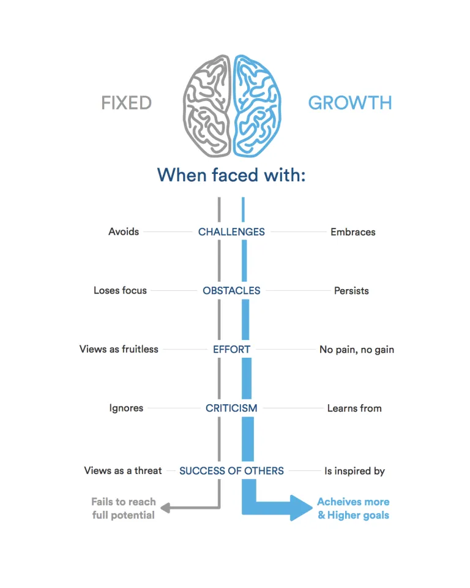

# reading-notes
## Hello, This is Abdullah Nazzal I'm 25 years old, I'm graduated from the Jadara University, majored Software Engineering 

| File      | Link |
| ----------- | ----------- |
| Read01  | [Readme](README.md)|
| MasterMardown   | [MasterMarkdown](MasterMarkdown.md)        |
## Growth Mindset 

### How you can benefit from a growth mindset And Why? 

#### A growth mindset believes that one’s fundamental abilities can be developed through perseverance and effort; intelligence and talent are simply good starting points. A growth mindset is synonymous with a love of learning. But in a fixed mindset, intelligence and talent are seen as fixed traits, without the need for further development or effort. 

#### Here’s the differences between a fixed and a growth mindset: 
- **Challenges:**
In a fixed mindset when challenging problems you can not solved you will giving up, But in the growth mindset you walk through the problem once again, bit by bit, looking for new ways to think about it until you solved problem.
- **Obstacles:**
In a fixed mindset when you have roadblock you immediately divert you attention to something else. and lose focus, But in the growth mindset you have solution is to stand up, put down whatever project is sucking the gumption out of you, walk away, and return when you’re feeling more inspired.
- **Effort:**
In a fixed mindset as example When my alarm goes off at 5 A.M. to play cycling, the thought of going out on the bike is dreadful But in the growth mindset you make a conscious effort to stop and think about the growth mindset. you ask yourself, is going back to sleep really what I want to do? Am I giving up too easily? Would I rather shower off pangs of regret, or the sweat of accomplishment? C’mon, the answers are obvious **_“no pain, no gain”_**.
- **Criticism**
- **Success of others:**
In a fixed mindset when yoy was fiercely jealous of people I thought were more successful or more intelligent, But in the growth mindset with the help of our culture of openness and honesty, I was able to understand how the work I do relates to the work of my peers, and how it all comes together to create something awesome. 

## reference : [Growth Mindset](https://www.atlassian.com/blog/inside-atlassian/growth-mindset)