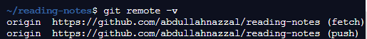

# Git Remote

## Every project have remote repositories, and should  manage it, and Remote repositories are versions of your project that are hosted on the Internet or network somewhere.

## By added git remote command on Shell, you can view the short names, such as “origin,” of all specified remote handles.

### If I added git remote -v, you can view all the remote URLs next to their corresponding short names.

** example: **
When i added git remote -v, Show me like that:

