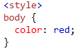

# CSS
## What is CSS?

## CSS (Cascading Style Sheets) allows you to create great-looking web pages, And how the is looking.

## By using CSS I can change any html property

### There are many way to insert CSS:

    External CSS:
    Is to creata an new .CSS file and put the link inside head tage in .html file
    Internal CSS:
    Is to add Style tage inside the head tage.
    Inline CSS:
    Is to add Style tage inside the tage.

** CSS color Property: **

if i want to change the text color just [color:red;] inside the tage.

** Like This: **

